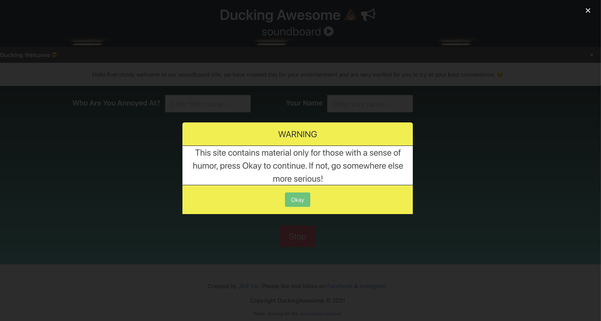
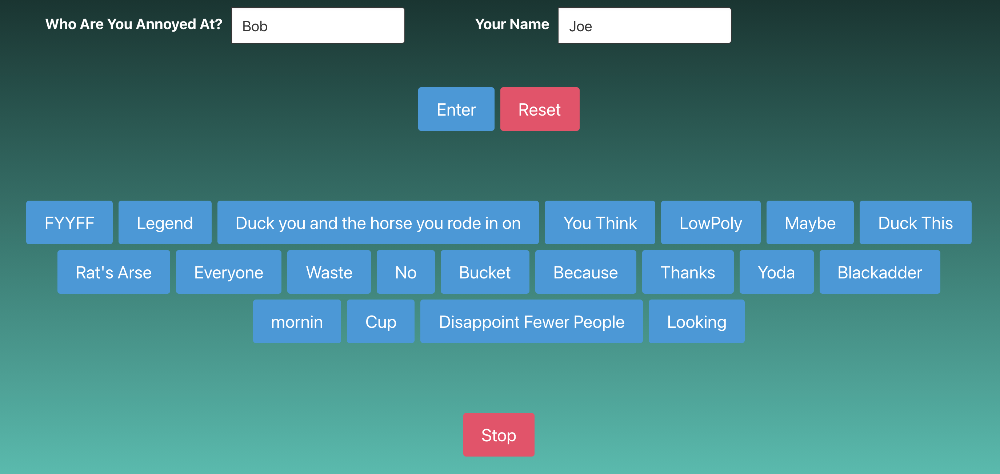

# Ducking Awesome Soundboard

## Description

 Team Mongoose has build an unique soundboard thats allows the stressed indvidual to let go of some frustration. This app runs in the browser and features dynamic HTML and CSS ([Bulma](https://bulma.io/)), while retrieving data from two different server side APIs ([VoiceRSS](http://www.voicerss.org/) and [FOAAS](https://www.foaas.com/)). This has a clean and polished, responsive user interface that adapts to multiple screen sizes. The soundboard is interactive, as it requries user input to work. It uses the local storage to save the names until a reset is desired.

 ## User Story
```
AS A stressed employee
I WANT to be able to tell off my supervisor or my annoying co-worker, without actually doing it myself or using profanity
SO THAT we can avoid an engagement between a supervisor and an employee where they are involved in a knowledge transfer about an impending vocational paradigm shift...or in other words get fired
```

## Acceptance Criteria
```
GIVEN I am a stressed user at work
WHEN I need a way to blow off steam
THEN I go to a censored soundboard
WHEN I enter names into the input text
THEN the buttons will appear
WHEN I click on a button
THEN someone else reads out my frustration
```

## How to Use:

Upon first accessing the website you get a warning modal that can be dismissed using the green Okay button, or the white X in the top right corner. Then, enter the desired name of who you are stressed out at, and your own name. Push Enter to submit and sit back while the API calls do all the work and the buttons generate.

Once the API calls are complete, press whichever button you want read out loud by the talk to speech! You can press as many buttons as you want, as often as you want. All swear words should be filtered out for profanity. Press the stop button to stop the audio. Twenty random buttons are generated each time, so refresh the page to get twenty new ones. Pressing reset will clear out the local storage (delete the names from the input boxes) and refresh the page.

[Come play with it here!](https://corgimaman.github.io/groupProject/)

### Future Developments
- Let user choose language
- Let user choose voice of person speaking (API has choices!)


[Powerpoint Presentation](https://docs.google.com/presentation/d/1-ty8rQG_ONTYsHnaQ4QCeY7RarS1kNIU0pFJT_Mak98/edit?usp=sharing)

### Team
Letter | Name
------------ | -------------
E | Erick Flores
I | Ida Shalilian
J | Jesse Ceniceros
K | Kevin Henley